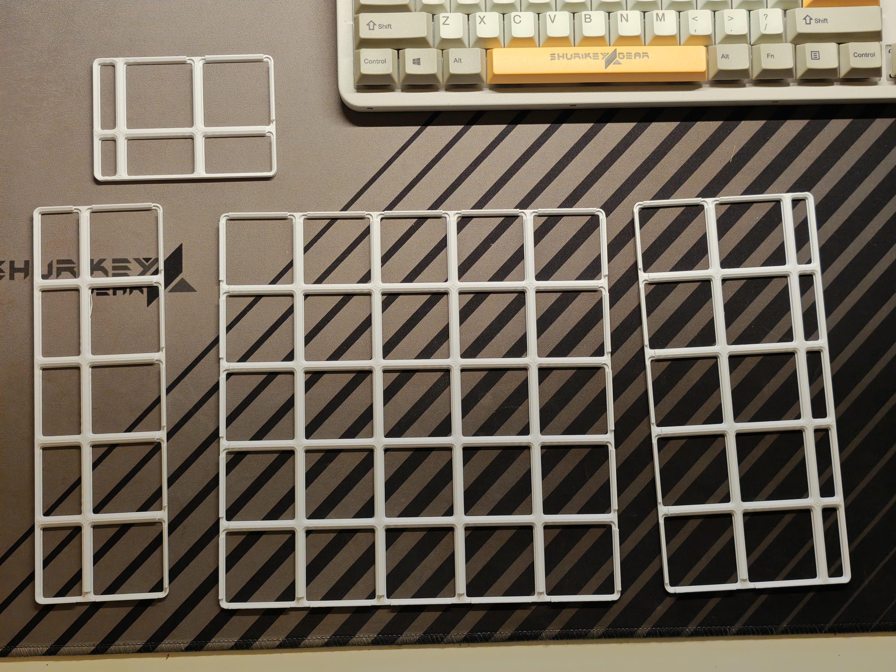
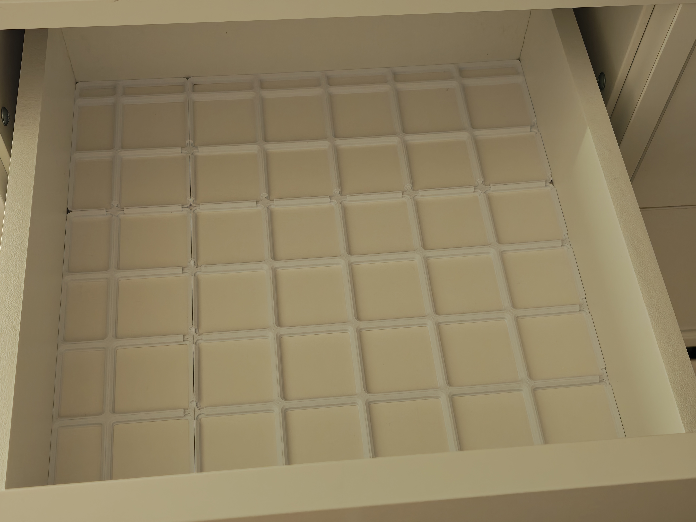
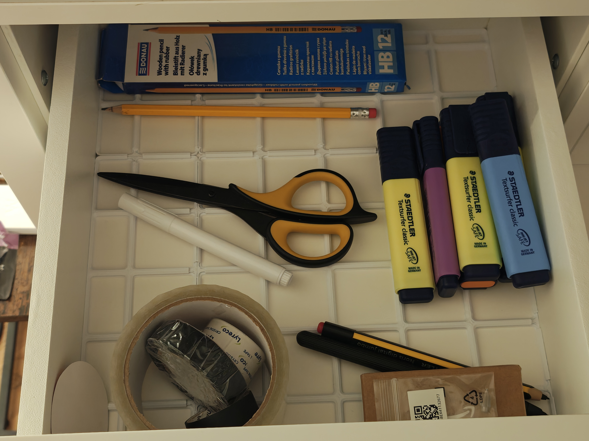
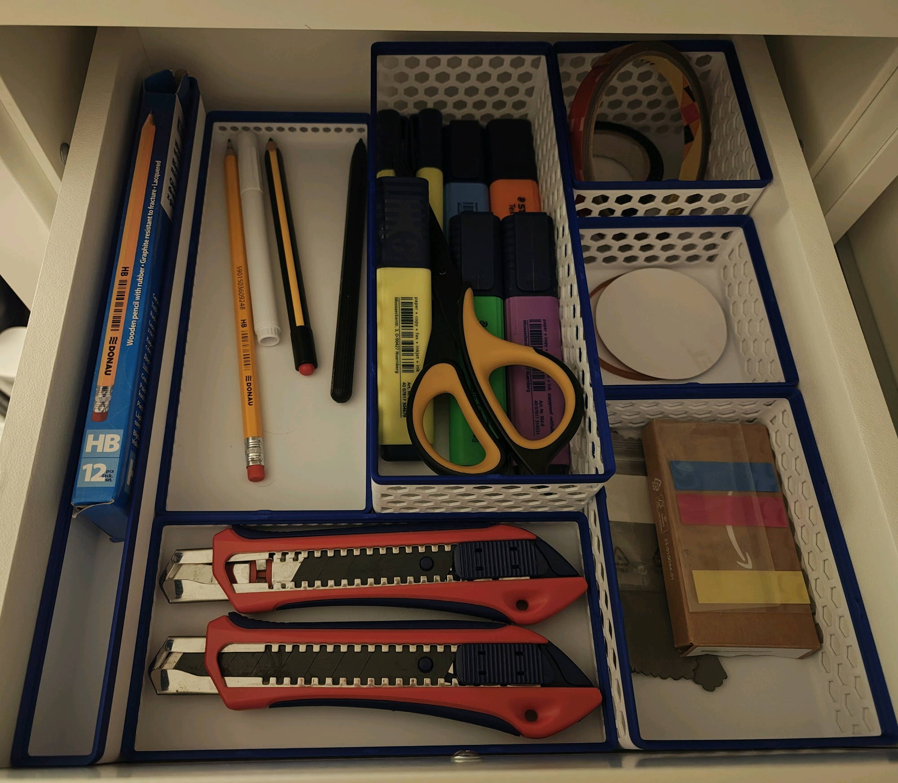

I just completed organization of 4 Kallax drawers using Gridfinity. I'm super happy with the result, so I thought I can document the process.

**Prerequisite: a 3d-printer**

## Step 1: remove everything from the shelf

If you are like me, you have a pile of mess. Don't try to organize it (yet), just grab a box and put everything away. 

*Tip: clean the shelf now - it will be much harder to do with a grid installed.*

## Step 2: make the baseplate

Gridfinity = Grid + Boxes. At first, we need the **Grid**.

1. Measure the shelf as precisely as you can in millimeters. 
2. Go to wonderful [Gridfinity Generator](https://gridfinity.perplexinglabs.com/pr/gridfinity-extended/0/1). 
3. On *Baseplate* tab, enter your measurements in `Grid width` and `Grid length`. 
4. Press `Render` and then download and print. 

## Step 3: plan the layout

Insert you grid in the shelf. Ensure it fits well (otherwise it's the right time to fix the measurement errors). 

Next, you can put all your items back from the box. Try to move them around, mentally grouping them in the boxes. Change several layouts until you find the best. 

*Tip: draw the layout on squared paper*. 

It's hard to test the heights of the boxes, so use common sense and imagination to decide on that. 

## Step 4: print the boxes

Now you should know which boxes do you need. You can either switch to [Basic Bin](https://gridfinity.perplexinglabs.com/pr/gridfinity-extended/0/0) tab of the generator and generate them yourself, or use any custom models. I'm using [these](https://makerworld.com/models/437387) with custom coloring.

*Note: it's unlikely that you dimensions are exactly 42x/42y, so there is probably some space left. In my cases the gap was pretty big, 26mm, so I also printed custom boxes. For that, use the generator.*

## Step 5: assemble and enjoy! 

When boxes are printed, put everything together and enjoy! 

*(The best part is, when you decide to change the layout, you don't need to start from scratch - just re-shuffle the existing boxes)*