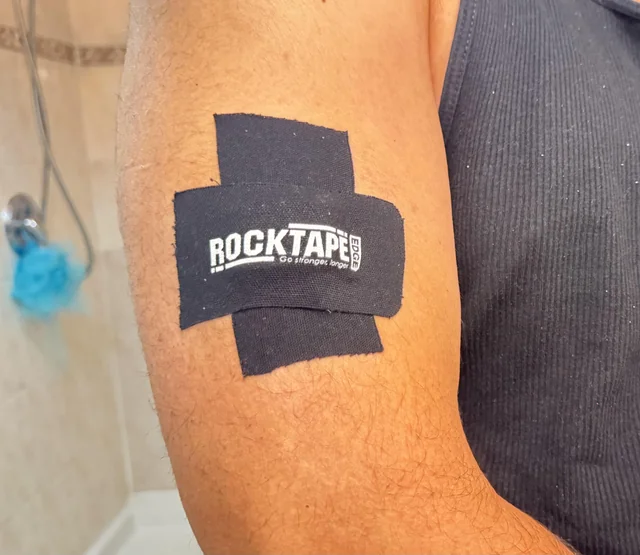

*I originally found this tip on reddit and the comments were full of sarcastic jokes. I still decided to give it a try and haven't looked back since. Unfortunately, the original post is deleted now.*

## The Tip

If you don't like constantly wearing a band, especially at night, consider just taping your wearable to your body. It's much less intrusive and you can almost forget you're wearing something.

**Where?** Biceps work well. 

**How?** There are options:
- Some people use **KT tape**. 

- I use **Tegaderm film** 6x7. 

- **CGM patches** are recommended online. Makes total sense, but I haven't tried them myself yet. 

You don't need to remove it for showering, but changing the patch each 3-4 days is advisable for hygiene underneath. 