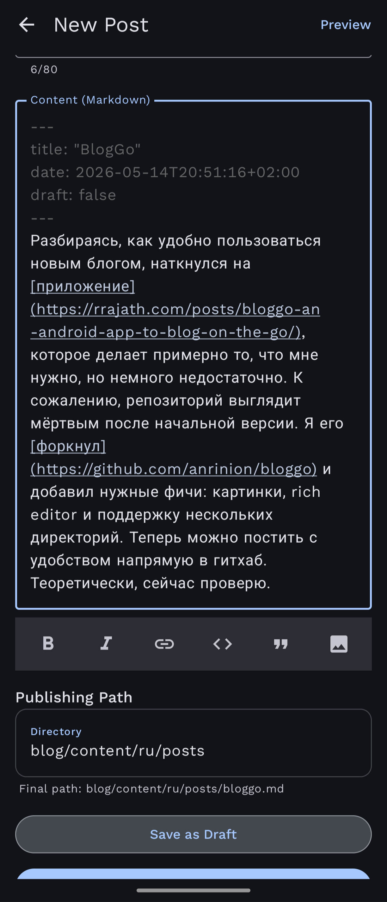

Разбираясь, как удобно пользоваться новым блогом, наткнулся на [приложение](https://rrajath.com/posts/bloggo-an-android-app-to-blog-on-the-go/), которое делает примерно то, что мне нужно, но немного недостаточно. К сожалению, репозиторий выглядит мёртвым после начальной версии. Я его [форкнул](https://github.com/anrinion/bloggo) и добавил нужные фичи: картинки, rich editor и поддержку нескольких директорий. Теперь можно постить с удобством напрямую в гитхаб. Теоретически, сейчас проверю. 

